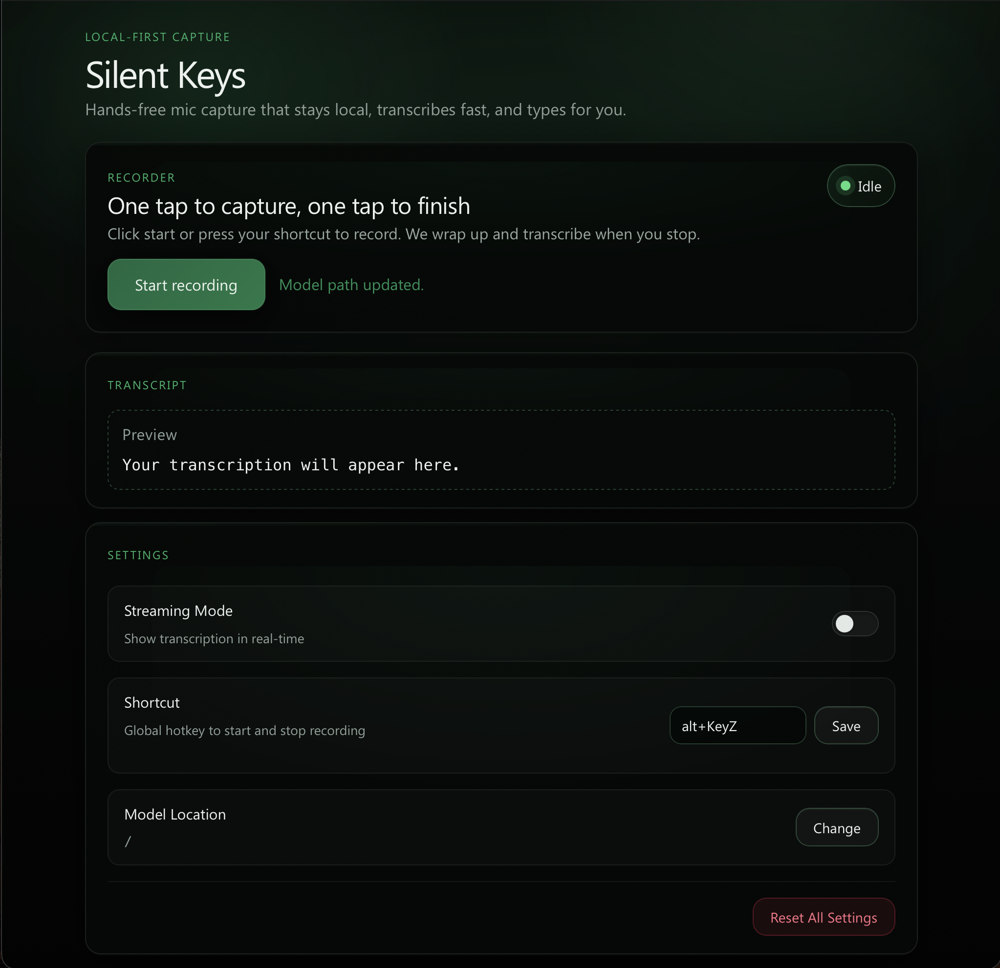

<div align="center">

# 🗝️ SilentKeys

**Real-time, fully offline desktop dictation.**

macOS-first, with experimental Linux and Windows builds.  
Fast, private, and small. No cloud, no telemetry.

[](https://www.apple.com/macos/)
[](https://www.rust-lang.org/)
[](https://v2.tauri.app/)
[](https://leptos.dev/)
[](https://docs.nvidia.com/nemo-framework/user-guide/latest/nemotoolkit/asr/models.html)
[](LICENSE)
[](https://github.com/gptguy/silentkeys/stargazers)
[](https://github.com/gptguy/silentkeys/actions/workflows/publish.yml)

<p align="center">
  
</p>

</div>

---

## 📋 Table of Contents

- [About](#-about)
- [Features](#-features)
- [Why SilentKeys?](#-why-silentkeys)
- [How It Works](#-how-it-works)
- [Quick Start](#-quick-start)
- [Installation](#-installation)
- [Roadmap](#️-roadmap)
- [Who Is This For?](#-who-is-this-for)
- [Contributing](#-contributing)
- [License](#-license)
- [Acknowledgments](#-acknowledgments)

---

## 💡 About

SilentKeys is a local-first desktop dictation app that performs all audio capture and transcription locally on your machine. It is designed for everyday use on Apple Silicon Macs and remains under active development.

- **Target Platform**: macOS 14+ on Apple Silicon (M1/M2/M3/M4).
- **Secondary Platforms**: Intel macOS, Linux, and Windows builds are available via Cargo but are currently considered experimental.
- **Resource Footprint** (M-series Mac, release build):
  - **Binary Size**: ~10 MB (native engine)
  - **Memory Usage**: ~800–900 MB (with default quantized Parakeet model loaded)

> [!NOTE] 
> **Status: Beta**  
> Stable for everyday dictation on Apple Silicon Macs. Some features and configuration options are still evolving.

---

## ✨ Features

- 🏎 **Real-time Dictation**: Types text directly into any application as you speak.
- 🔒 **Offline Only**: Audio and transcripts never leave your device.
- 🧠 **High-Quality Models**: Uses NVIDIA's Parakeet models running on ONNX Runtime, optimized for Apple Silicon.
- 🖥 **macOS-First**: Native feel with global push-to-talk, streaming output, and minimal latency.
- ⚙️ **Rust Core**: Built for performance, low latency, and stability.
- 🪶 **Lightweight UI**: Powered by Tauri v2 and Leptos (no Electron overhead).
- 🛡️ **Zero Telemetry**: No analytics, tracking, or background network calls.
- 🆓 **Open Source**: MIT licensed and free to use.

---

## 🚀 Why SilentKeys?

Most dictation tools affect your privacy, transparency, or workflow. SilentKeys eliminates these compromises:

- **Local Processing**: All audio capture and transcription happen on-device.
- **Transparency**: The codebase is fully open source, allowing you to audit how your data is handled.
- **Workflow Integration**: Streams text into your existing tools (email, code editors, chat) without requiring plugins.
- **Modern Stack**: Built on Rust, Tauri, and ONNX Runtime for a lean, maintainable, and predictable application.

---

## 🧩 How It Works

The speech engine uses Parakeet models via ONNX Runtime embedded in a Rust core.

1. **Global Hook**: A lightweight Rust daemon listens for the configurable push-to-talk shortcut.
2. **Audio Capture**: Captures high-fidelity audio from the system microphone using low-latency buffers.
3. **Inference**: Audio chunks are processed by the Parakeet model via ONNX Runtime.
4. **Streaming**: Silero VAD detects phrase boundaries to stream accurate partial transcripts.
5. **Virtual Typing**: The `Enigo` crate drives virtual keypresses to insert text into the focused window.

---

## ⚡ Quick Start

### Prerequisites
- **macOS 14.0+ (Sonoma)** recommended.
- **Apple Silicon** (M1 or newer).
- **Rust Toolchain**: Installed via `rustup`.

### Running Locally

```bash
# 1. Clone the repository
git clone https://github.com/gptguy/silentkeys
cd silentkeys

# 2. Run in development mode
cargo tauri dev
```

### Building for Release

```bash
cargo tauri build
```
The bundled application will be available at:  
`src-tauri/target/release/bundle/macos/SilentKeys.app`

---

## 🎙 Usage

1. **Start Dictation**: Press **⌥Z** (Option+Z) to begin.
2. **Speak**: Speak normally; text will appear in your active application.
3. **Stop**: Press the shortcut again (or stop speaking) to finish the session.

### Configuration
Preferences can be accessed via the UI to configure:
- **Global Shortcut**: Customize the hotkey.
- **Streaming Mode**: Toggle real-time text visualization (uses Silero VAD for phrase detection).
- **Model Path**: Manage the location of the ONNX model files (VAD model is auto-downloaded here).

---

## 📥 Installation

### Download
Official signed DMG builds and a Homebrew tap will be available soon.

### Build from Source
To build from source, ensure you have the following installed:

1. **Xcode Command Line Tools**: `xcode-select --install`
2. **Rust**: `curl --proto '=https' --tlsv1.2 -sSf https://sh.rustup.rs | sh`
3. **WebAssembly Target**: `rustup target add wasm32-unknown-unknown`
4. **Trunk**: `cargo install trunk`
5. **Tauri CLI**: `cargo install tauri-cli --locked`

Then run:
```bash
cargo tauri build
```

---

## 🛠️ Roadmap

**Core**
- [x] Improve streaming behavior (VAD-based sequencing).
- [ ] Add local-only crash reporting (opt-in).

**Performance**
- [ ] Benchmark Parakeet vs. alternative ASR architectures.
- [ ] Optimize batching for long dictation sessions.
- [ ] leverage ONNX Runtime Execution Providers (CoreML, Metal).

**Distribution**
- [ ] Provide signed and notarized DMG releases.
- [ ] Create Homebrew tap (`brew install --cask silentkeys`).
- [ ] Implement automatic updates.

---

## 🔐 Privacy

SilentKeys is private by default:

- **No Cloud Services**: All processing is local.
- **No Analytics**: No usage data or metrics are collected.
- **No Auto-Updates**: Release builds do not perform background checks.
- **Offline Capable**: Works entirely without an internet connection (after model download).

---

## 🧑‍🤝‍🧑 Who Is This For?

- **Privacy-conscious professionals** (legal, healthcare, journalism).
- **Writers and creators** who prefer voice drafting.
- **Accessibility users** seeking a robust, offline-capable dictation tool.

---

## 🤝 Contributing

Contributions are welcome! Please see [CONTRIBUTING.md](CONTRIBUTING.md) for guidelines on how to get started.

---

## 🛡️ License

Licensed under the [MIT License](LICENSE).

---

## ⭐ Acknowledgments

- **[Parakeet](https://docs.nvidia.com/nemo-framework/user-guide/latest/nemotoolkit/asr/models.html)**: State-of-the-art ASR models.
- **[ONNX Runtime](https://onnxruntime.ai/)**: High-performance inference engine.
- **[Tauri](https://tauri.app/)**: For the lightweight application framework.
- **[Leptos](https://leptos.dev/)**: For the reactive frontend.

---

<div align="center">

**SilentKeys**  
*Dictation that stays on your machine.*

[⬆ Back to Top](#-silentkeys)

</div>
