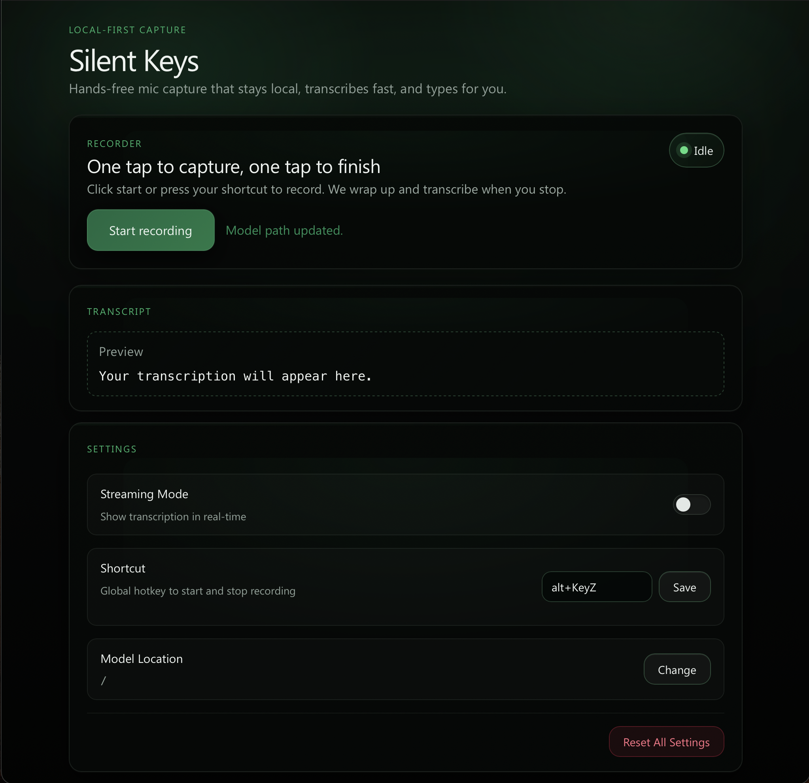

<div align="center">

# 🗝️ SilentKeys

**Real-time, local desktop dictation.**

macOS-first, with experimental Linux and Windows builds.  
Audio and transcription stay on-device. No telemetry.

[](https://www.apple.com/macos/)
[](https://www.rust-lang.org/)
[](https://v2.tauri.app/)
[](https://leptos.dev/)
[](https://huggingface.co/smcleod/nemotron-3.5-asr-streaming-0.6b-int8)
[](LICENSE)
[](https://github.com/gptguy/silentkeys/actions/workflows/publish.yml)

<p align="center">
  
</p>

</div>

---

## 💡 About

SilentKeys is a desktop dictation app that performs all audio capture and transcription locally on your machine, streaming text into whatever application has focus — no plugins required. The scope is deliberately narrow: local, system-wide speech-to-text and nothing else. It is designed for everyday use on Apple Silicon Macs and remains under active development.

- **Target Platform**: macOS 14+ on Apple Silicon (M1/M2/M3/M4).
- **Secondary Platforms**: The release workflow targets Intel macOS, Linux, and Windows, but those builds remain experimental until their platform acceptance gates pass.
- **Resource Footprint** (measured on an M-series Mac):
  - **App executable**: approximately 20 MB; signed updater archive approximately 9 MB
  - **Downloaded model**: approximately 683 MB
  - **Memory usage**: approximately 800–900 MB with the model loaded

> [!NOTE] 
> **Status: Beta**  
> The core path is regression-tested on Apple Silicon, but distribution and
> broader-corpus accuracy acceptance are still in progress.

---

## ✨ Features

- **Real-time Dictation**: Types text directly into any application as you speak.
- **Local Transcription**: Audio and transcripts never leave your device.
- **Streaming ASR**: Uses a pinned INT8 export of NVIDIA Nemotron 3.5, a cache-aware Parakeet/FastConformer-family model, through ONNX Runtime.
- **macOS-First**: Native feel with global push-to-talk, streaming output, and minimal latency.
- **Rust Core**: Built for performance, low latency, and stability.
- **Lightweight UI**: Powered by Tauri v2 and Leptos (no Electron overhead).
- **Zero Telemetry**: No analytics or tracking.
- **Open Source**: MIT licensed and free to use.

---

## 🧩 How It Works

The Rust core runs a pinned Nemotron 3.5 INT8 model locally through ONNX Runtime
and `parakeet-rs`. It does not use the separate Parakeet TDT 0.6B v3 model.

1. **Global Shortcut**: The desktop app listens for the configurable push-to-talk shortcut.
2. **Audio Capture**: Captures the system microphone through a real-time-safe ring buffer and resamples to 16 kHz mono.
3. **Inference**: Audio chunks are processed by Nemotron via ONNX Runtime.
4. **Streaming**: Partial transcripts are streamed while audio is captured.
5. **Virtual Typing**: The `Enigo` crate drives virtual keypresses to insert text into the focused window.

---

## ⚡ Quick Start

### Prerequisites
- **macOS 14.0+ (Sonoma)** recommended, on **Apple Silicon** (M1 or newer).
- **Xcode Command Line Tools**: `xcode-select --install`
- **Rust**: `curl --proto '=https' --tlsv1.2 -sSf https://sh.rustup.rs | sh`
- **WebAssembly Target**: `rustup target add wasm32-unknown-unknown`
- **Trunk**: `cargo install trunk`
- **Tauri CLI**: `cargo install tauri-cli --locked`

### Running Locally

```bash
# 1. Clone the repository
git clone https://github.com/gptguy/silentkeys
cd silentkeys

# 2. Run in development mode
cargo tauri dev
```

### Building for Release

```bash
cargo tauri build
```
The macOS application bundle will be available at:
`target/release/bundle/macos/SilentKeys.app`

---

## 🎙 Usage

1. **Start Dictation**: Press and hold **⌥Z** (Option+Z).
2. **Speak**: Text is typed into the focused application while you hold the shortcut.
3. **Stop**: Release the shortcut.

### Configuration
Preferences can be accessed via the UI to configure:
- **Global Shortcut**: Customize the hotkey.
- **Speech Language**: Use deterministic English (US), follow the system locale,
  enable automatic detection, or select any language prompt exposed by the
  installed model.
- **Streaming Mode**: Toggle real-time text visualization.
- **Model Path**: Manage the location of the ONNX model files.

Model-path changes take effect after the application restarts.

English (US) is the default because an explicit language prompt is more
predictable than language detection for English dictation. The language dropdown
also offers the operating-system language, automatic detection, and every
distinct language prompt declared by the installed Nemotron model. The dropdown
uses the first code declared for each prompt so aliases do not create duplicate
choices. Accuracy and latency vary by language, accent, audio quality, and
hardware.

---

## 📥 Installation

### Download
Prebuilt binaries are published on the
[GitHub Releases](https://github.com/gptguy/silentkeys/releases) page. Public
macOS builds are not yet notarized, so the first updater-enabled release must be
installed manually; once installed, the app checks for newer signed releases and
installs them automatically.

### Build from Source
Install the [prerequisites](#prerequisites) listed under Quick Start, then run:
```bash
cargo tauri build
```

---

## 🛠️ Roadmap

**Core**
- [x] Improve streaming behavior (partial stability + buffering).
- [ ] Add local-only crash reporting (opt-in).

**Performance**
- [x] Record exact-fixture release performance and real-time factor.
- [ ] Benchmark representative dictation corpora against alternative ASR architectures.
- [ ] Optimize batching for long dictation sessions.
- [ ] Evaluate ONNX Runtime execution providers where they improve measured latency.

**Distribution**
- [ ] Provide signed and notarized DMG releases.
- [ ] Create Homebrew tap (`brew install --cask silentkeys`).
- [x] Implement signed automatic updates.
- [ ] Complete two-release updater acceptance on every release target.

---

## 🔐 Privacy

SilentKeys is private by default:

- **No Cloud Transcription**: Speech processing is local; networking is limited
  to model downloads plus signed update checks and downloads.
- **No Analytics**: No usage data or metrics are collected.
- **Signed Updates**: Release builds are configured to check immediately and every six hours, install a newer signed GitHub Release automatically, and request restart.
- **Offline Dictation**: Dictation continues without an internet connection after the model is downloaded.

---

## 🤝 Contributing

Contributions are welcome! Please see [CONTRIBUTING.md](CONTRIBUTING.md) for guidelines on how to get started.

---

## 🛡️ License

Licensed under the [MIT License](LICENSE).

---

## ⭐ Acknowledgments

- **[Nemotron 3.5 ASR](https://huggingface.co/smcleod/nemotron-3.5-asr-streaming-0.6b-int8)**: The local speech model.
- **[ONNX Runtime](https://onnxruntime.ai/)**: High-performance inference engine.
- **[Tauri](https://tauri.app/)**: For the lightweight application framework.
- **[Leptos](https://leptos.dev/)**: For the reactive frontend.
